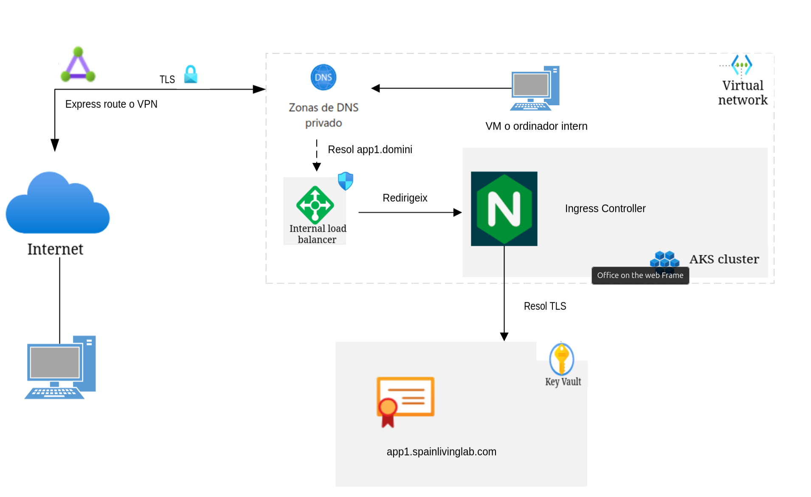

# Arquitectura amb serveis interns a una xarxa privada

En aquest cas hi identificam 2 escenaris:

1. Es disposa d'una xarxa privada en la qual hi ha ordinadors connectats.
2. Es disposa d'una xarxa privada virtual al núvol (p.e a Azure).

En el primer escenari hauriem de tenir una Zona DNS privada que resolgui els subdominis corresponents als serveis de l'agent. Ara bé, seguim necessitant una ip pública i un DNS públic en propietat
per assignar-los a la tier-2 gateway. Recordem que els agents es comunicaran entre ells per aquesta entrada.

En el segon escenari, tenim dues opcions per connectarnos a la xarxa virtual:

1. Adquirir una Virtual Machine (VM) i que estigui connectada a la VNet.
2. Adquirir un servei de VPN point-to-site o site-to-site per a connectar els ordenadors externs a la VNet.

Dins la VNet hi hauria d'haver una Zona DNS privada que resolgui els subdominis. Un cop resolta la ip privada, el tràfic passarà per el Load Balancer Intern.

