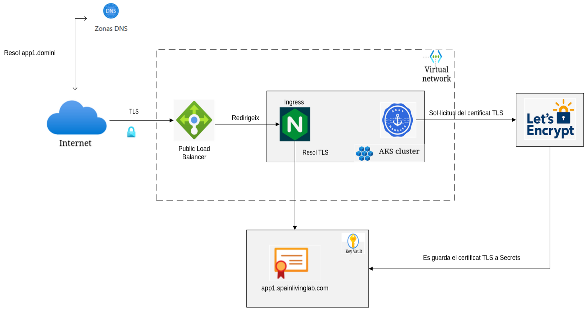

# Arquitectura per a serveis exposats a Internet

En el nostre cas, vàrem desplegar aquesta arquitectura amb azure AKS. 

El controlador d'ingrés genera un Load Balancer, el qual obté una IP pública de manera automàtica (en el cas d'azure). Aquest controlador generarà i resoldrà els TLS de manera automàtica.
Necessitarem disposar d'un DNS públic en propietat. Tot el tràfic, tant el de la tier-1 gateway com el de la tier-2 passaran per l'ingress.