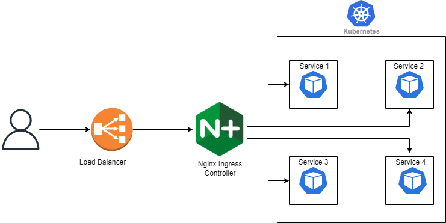

- [Desplegament dels Prerrequisits](#desplegament-aplicació-amb-argocd)
  - [Desplegament i configuració d'ingress nginx](#instal·lació-dargocd)
  - [Desplegament i configuració d'ArgoCD](#instruccions-per-desplegar-laplicació)
  - [Desplegament i configuració d'External DNS](#instruccions-per-desplegar-laplicació)
  - [Desplegament i configuració de CertificateManager](#instruccions-per-desplegar-laplicació)
  - [Desplegament i configuració de NFS CSI provisioner](#instruccions-per-desplegar-laplicació)
---

# Desplegament dels Prerrequisits
## Desplegament i configuració d'ingress nginx

Controlador d'ingrés basat en Nginx, gestiona el tràfic d’entrada HTTP/HTTPS cap a les aplicacions del clúster. Treballa conjuntament amb External DNS i Certificate Manager per exposar serveis de manera segura i automatitzada.



### Instal·lació

```bash
helm repo add ingress-nginx https://kubernetes.github.io/ingress-nginx
helm repo update

kubectl create namespace ingress-nginx
helm install ingress-nginx ingress-nginx/ingress-nginx \
    --namespace ingress-nginx \
    --set controller.replicaCount=2 \
    --set controller.nodeSelector."kubernetes\.io/os"=linux \
    --set defaultBackend.nodeSelector."kubernetes\.io/os"=linux


helm install ingress-nginx ingress-nginx/ingress-nginx \
  --namespace ingress-nginx --create-namespace \
  --version 4.10.0
```

L'eina tindrà el seu propi namespace. Comprovam que s'ha instal·lat correctament:

```bash
kubectl get pods -n ingress-nginx
```

Hauria de sortir:

```bash
NAME                                       READY   STATUS      RESTARTS   AGE
ingress-nginx-admission-create-qhjcq       0/1     Completed   0          4d20h
ingress-nginx-admission-patch-s2695        0/1     Completed   0          4d20h
ingress-nginx-controller-9cc49f96f-96xdq   1/1     Running     0          4d20h
```

A continuació comprovarem l'IP extern o port del controlador ingress

```bash
kubectl get svc -n ingress-nginx
```

Hauria de sortir:

```bash
NAME                                 TYPE        CLUSTER-IP     EXTERNAL-IP   PORT(S)                      AGE
ingress-nginx-controller             NodePort    10.111.45.147   <none>        80:32691/TCP,443:32613/TCP   4d20h
ingress-nginx-controller-admission   ClusterIP   10.101.37.174   <none>        443/TCP                      4d20h
```

Podem veure que per defecte tipus de servei del controlador d'ingress és "NodePort". En el nostre cas vàrem canviar el tipus a "LoadBalancer".

Un Load Balancer (equilibrador de càrrega) és un component que:

1. Rep el trànsit entrant des d’Internet

2. El distribueix entre diversos pods o nodes

3. Proporciona un únic punt d’entrada a les aplicacions

4. Millora la disponibilitat, escalabilitat i tolerància a fallades

5. En Kubernetes, el Load Balancer és habitualment el punt d’accés públic cap al clúster.

En el cas d'Azure, aquest LoadBalancer rep una ip pública automàticament. Si a l'entorn on es desplega aquest LoadBalancer no hi ha aquesta assignació automàtica 
de la IP pública, s'haurà de fer manualment.

## Desplegament i configuració d'ArgoCD

### Instal·lació d’ArgoCD

*(En aquesta secció s’haurà d’incloure la guia d’instal·lació d’ArgoCD al clúster de Kubernetes)*

### Instruccions per desplegar aplicació

Amb **ArgoCD** instal·lat al **clúster de Kubernetes**, la instal·lació de paquets i aplicacions es realitza mitjançant un arxiu de configuració `.yaml`, disponible a la carpeta `Arxius_Deployment`.

> ⚠️ **Atenció:** Abans de realitzar el desplegament, cal revisar les seccions específiques de cada component.

És **imprescindible** desplegar primer el paquet **COMMON** abans que qualsevol altre component.  
Posteriorment, s’ha de desplegar l’agent corresponent i, un cop finalitzat aquest procés, si és necessari, es pot desplegar l’altre agent.

> ⚠️ El paquet **COMMON** s’ha de desplegar només una vegada per entitat.  
> Els agents **CONSUMER** i **PROVIDER** s’han de desplegar segons les necessitats de cada entitat.

En tots els casos, el desplegament amb **ArgoCD** segueix el mateix procediment:

1. Fer clic a **+ New App**
2. Seleccionar **Edit as YAML**
3. Copiar i enganxar l’arxiu de configuració `.yaml` corresponent
4. Fer clic a **Save** per iniciar el desplegament de l’aplicació

<!-- <p align="center">
  
</p> -->


## Desplegament i configuració d'External DNS
## Desplegament i configuració de CertificateManager
## Desplegament i configuració de NFS CSI provisioner
