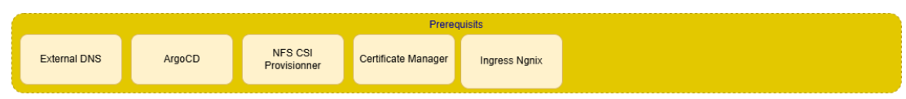

- [Ordre del Desplegament](#ordre-del-desplegament)
- [Desplegament dels Prerrequisits](#desplegament-aplicació-amb-argocd)
- [Configuració dels Agents](#configuració-dagents)
  - [Configuració paquet COMMON](#configuració-paquet-common)
    - [Arxiu YAML del paquet COMMON](#arxiu-yaml-del-paquet-common)
    - [Passos posteriors al desplegament del COMMON](#passos-posteriors-al-desplegament-del-common)
  - [Configuració Agent PROVIDER](#configuració-agent-provider)
    - [Arxiu YAML del paquet PROVIDER](#arxiu-yaml-del-paquetprovider)
    - [Passos posteriors al desplegament del PROVIDER](#passos-posteriors-al-desplegament-del-provider)
  - [Configuració Agent CONSUMER](#configuració-agent-consumer)
    - [Arxiu YAML del paquet CONSUMER](#arxiu-yaml-del-paquetconsumer)
    - [Passos posteriors al desplegament del CONSUMER](#passos-posteriors-al-desplegament-del-consumer)

---
# Ordre del desplegament

1. Prerrequisits Mínims
2. Common Components Agent
3. Consumer/Provider Agent

Aquest apartat es basa en la documentació oficial de [Simpl-Open](https://code.europa.eu/simpl/simpl-open/documentation).

# Desplegament dels Prerrequisits

Són els serveis que donen suport a la resta dels serveis associats als agents.

Aquests tenen les següents funcionalitats:

1. Ingress NGINX: actua com a controlador d’ingrés del clúster, gestionant l’accés extern als serveis desplegats a Kubernetes mitjançant regles HTTP/HTTPS. Permet exposar els serveis de manera segura i centralitzada, i facilita la gestió del trànsit d’entrada.

2. Argo CD: eina de desplegament continu basada en el paradigma GitOps. S’encarrega de sincronitzar l’estat del clúster amb la configuració declarativa definida en repositoris Git, garantint desplegaments traçables, reproductibles i auditables. En el nostre cas, ArgoCD sincronitzarà els repositoris de [SIMPL-Open Europe](https://code.europa.eu/simpl), els quals contenen les versions de les aplicacions i serveis associats a cada agent, amb l'estat del clúster.

3. External DNS: automatitza la creació i gestió dels registres DNS associats als serveis exposats del clúster. Permet actualitzar dinàmicament els registres DNS en funció dels serveis i ingressos desplegats.

4. NFS CSI Provisioner: proveeix un Container Storage Interface (CSI) basat en NFS que permet la creació dinàmica de volums persistents, especialment útil per a volums amb accés compartit (ReadWriteMany).

5. Certificate Manager: gestiona de manera automàtica l’emissió, renovació i ús de certificats digitals (per exemple, TLS/SSL) dins del clúster, facilitant la comunicació segura entre serveis i amb l’exterior.

Consulta la **[Guia del desplegament](Agents/prerrequisits.md)**.

---

# Configuració dels Agents

---

Consulta la **[Guia Configuració Agent COMMON](Agents/common.md)**.

---

Consulta la **[Guia Configuració Agent CONSUMER](Agents/consumer.md)**.

---

Consulta la **[Guia Configuració Agent PROVIDER](Agents/provider.md)**.

---
