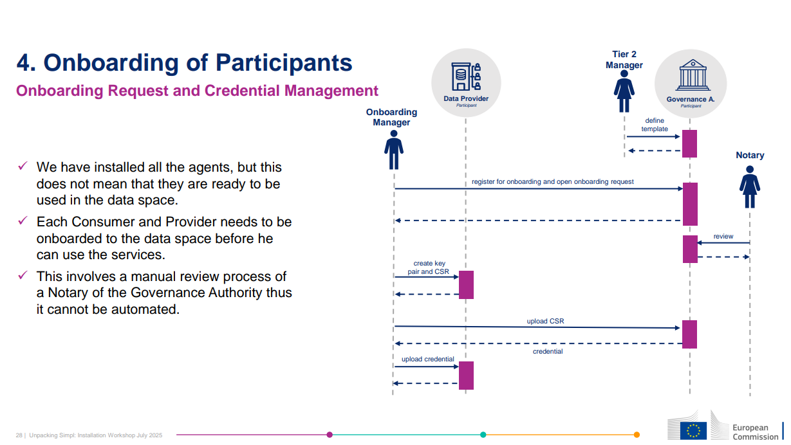
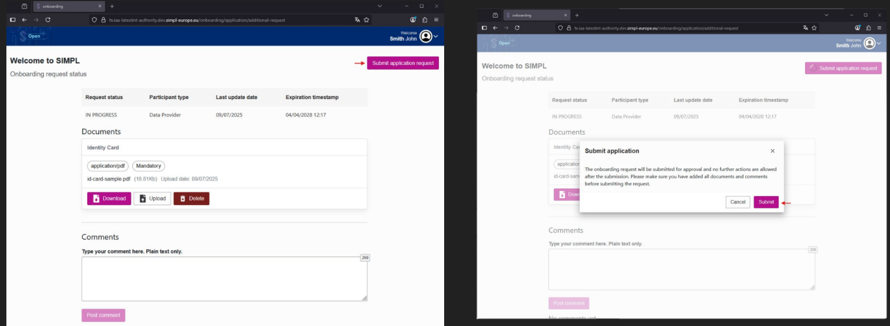

## Procés complet d’adhesió a l’espai de dades

  

El procés d’adhesió a l’ESDATIB es divideix en **dues parts principals**:

> ⚠️ **Atenció:** Aquest procés complet, amb les dues parts, és necessari **per cada agent**.  
> Si una entitat vol actuar com a **CONSUMER** i **PROVIDER**, serà necessari realitzar el procés **dues vegades**, una per a cada agent.

---

### 1. Part sense necessitat de desplegament ni configuració

L’entitat genera una sol·licitud que serà gestionada per l’administració de governança de l’ESDATIB.

**Emplenament de formulari:**  
L’entitat ha de completar el formulari de sol·licitud a:  
[https://authority.fe.authority01.ibtourismdataspace.org/onboarding/application/request](https://authority.fe.authority01.ibtourismdataspace.org/onboarding/application/request)

- En el camp **Participant_Type** apareixen quatre opcions.  
- Actualment només estan operatives: **Consumer** i **Data Provider**. L’entitat ha de seleccionar **una d’aquestes**.

  

Un cop completat el formulari i generades les credencials, l’usuari serà redirigit a un portal de sessió on podrà iniciar sessió amb les credencials recents.

**Pujar ID i submit application request:**  
En aquest portal, l’entitat ha de pujar un fitxer `ID.pdf` i fer clic a **Submit Application Request**.  

  

Un cop realitzada la sol·licitud, aquesta estarà llesta per ser processada per la **Governança**. Els passos següents requereixen **desplegament dels agents al cluster**.

---

### 2. Part amb desplegament dels agents

- En aquesta fase ja és necessari **desplegar els agents al cluster** per poder accedir a l’espai de dades i obtenir les credencials corresponents.  

> ⚠️ Proximament operatiu.
