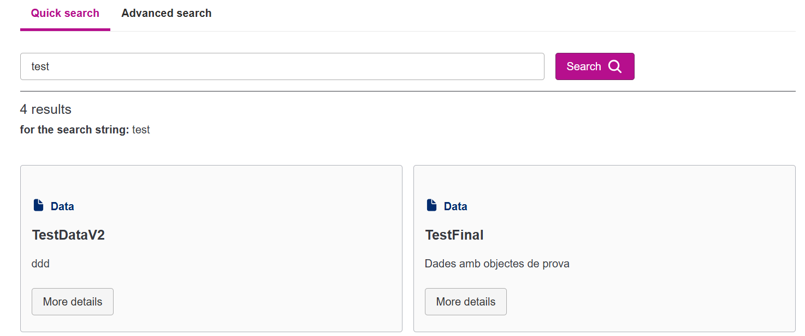
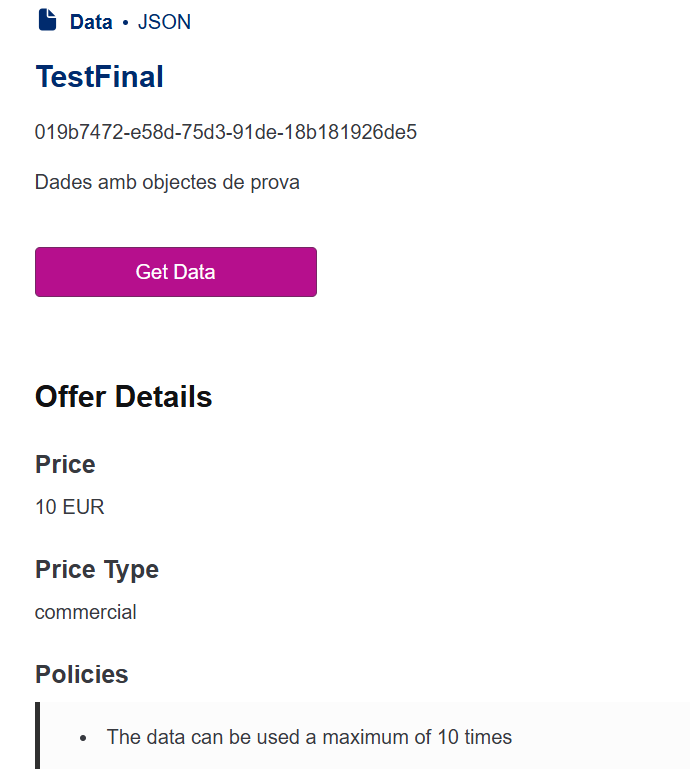
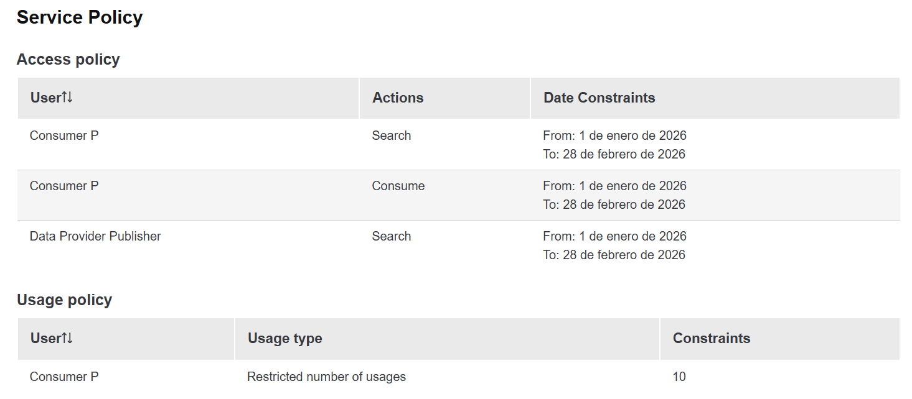
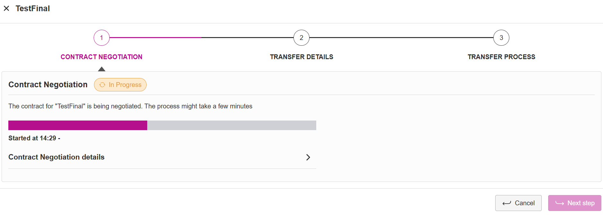
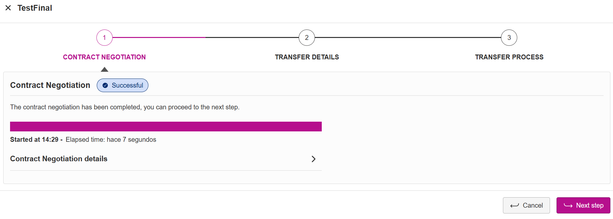
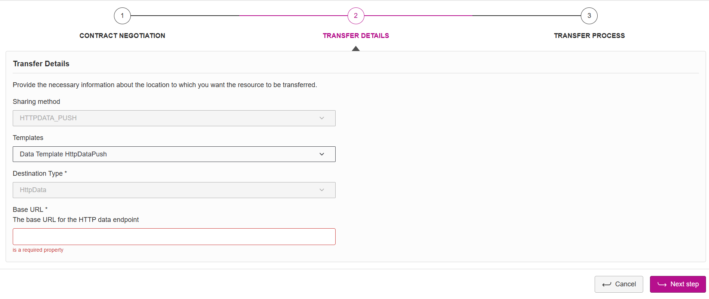

# Procés de consum de dades a l'ESDATIB

L'agent consumidor pot consultar al catàleg de dades les descripcions publicades.

Té 2 opcions de cerca:

1. Cerca ràpida: Es filtra pel nom de la descripció publicada
2. Cerca detallada: El consumidor té accés a filtres més detallats.

De tota manera, en els dos casos, el consumidor només podrà veure les descripcions les polítiques d'accés de les quals li permeten.

En entrar a una descripció podrem veure totes les metadates que va definir el proveïdor, així com les polítiques associades.

A més hi podem veure el botó de "Get Data" el qual iniciarà el procés de negociació del contracte.

Haurem d'esperar a que aquest procés automàtic acabi.

Per acabar, posarem l'endpoint que rebrà la transferència HTTP.

