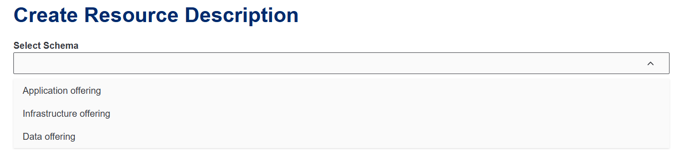
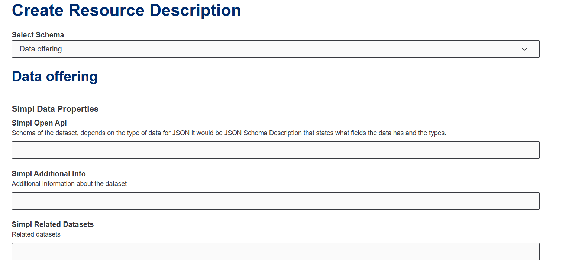
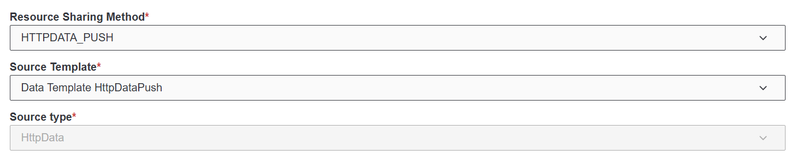
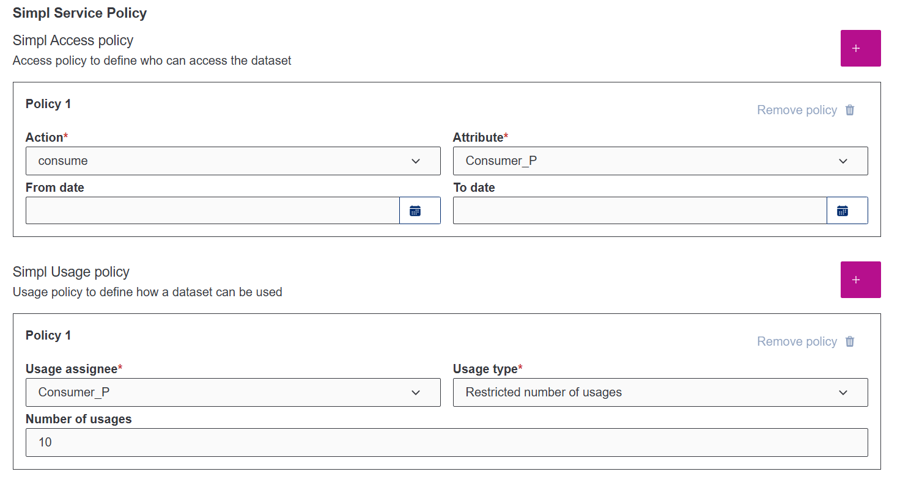
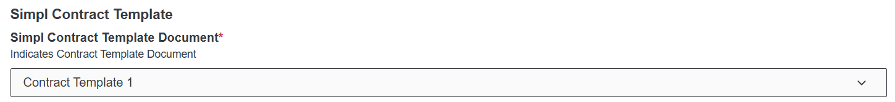

# Publicació d'una descripció de dades al catàleg

Un cop tenim l'agent proveïdor desplegat, ja podrem crear descripcions dels nostres conjunts de dades.

Seleccionarem l'opció "Data Offering" o oferiment de dades. La resta d'opcions encara no estan implementades. Seguidament podrem observar els diferents camps que podem omplir de la nostra descripció.

En vermell hi trobarem els camps que són obligatòris. Aquests són:

1. Resource Sharing Method: Mètode mitjançan el qual es comparteix el recurs.
2. Source Template: Plantilla que defineix com s'obté i s'envia el recurs.
3. Source Type: Tipus de enviament.
4. Resource Name: Nom del conjunt de dades a oferir.
5. Base URL: URL del conjunt de dades (API endpoint, direcció fitxer..).
6. Simpl Format: json, excel, csv...
7. Simpl Name: Nom del lloc on s'extreuen les dades.
8. Simpl Description: Descripció del lloc on s'extreuen les .
9. Simpl Service Access Point: Localització del lloc on s'extreuen les dades.
10. Simpl Language: Llenguatge de les metadades.
11. Simpl Contact i Signature: Correu de contacte del proveïdor i la seva signatura.
12. Simpl License: URL de la llicència utiitzada.
13. Simpl Currency: Tipus de doblers.
14. Simpl Price: Preu.
15. Simpl Price Type: De franc o comercial.
16. Acces Policy: Polítiques d'accés a la descripció.
17. Usage Policy: Polítiques d'us de les dades.
18. Contract Template: Plantilla del contracte.

Actualment només es permet l'enviament de les dades via HTTP. El consumidor haurà de tenir una URL de destí on podrà posar les dades rebudes.

Les polítiques és una altra part fonamental de les descripcions, amb elles definim qui pot consultar les descripcions i què pot fer amb elles.

Per acabar, també podem seleccionar la plantilla del contracte que volem utilitzar.

Un cop hem emplenat tots aquest cas, li donarem al botó de publicar. Si la validació de la descripció s'ha passat, llavors aquesta descripció es publicarà automàticament al catàleg federat.