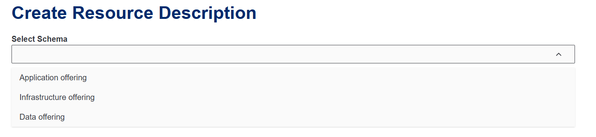
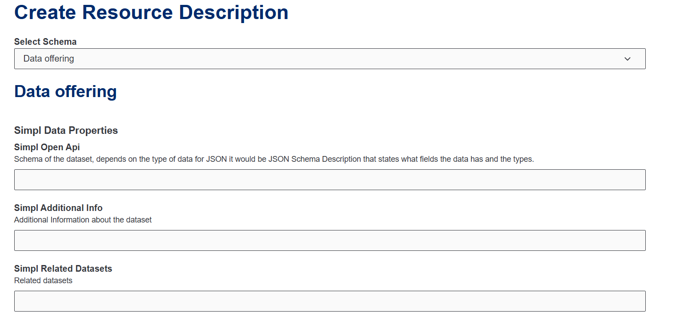
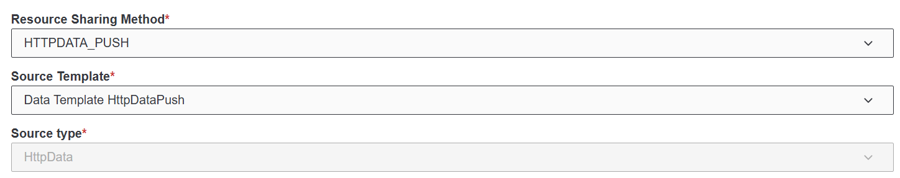
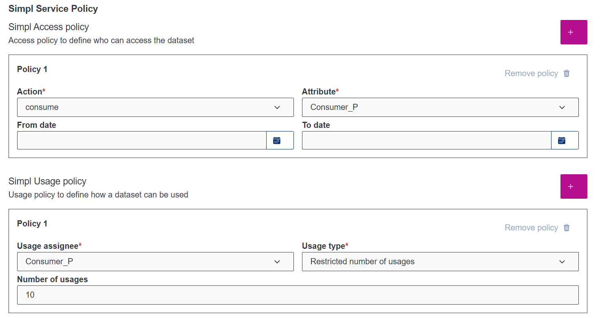
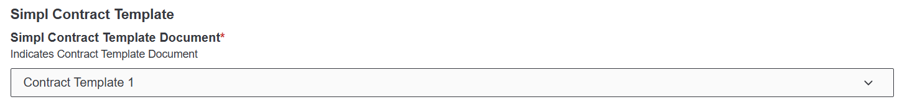

# Publicació d'una descripció de dades al catàleg

## Visió general

Un cop tenim l'agent proveïdor desplegat i l'entitat adherida a l'espai de dades, podem crear descripcions dels nostres conjunts de dades i publicar-les al catàleg federat de l'ESDATIB. Aquest procés permet que altres participants puguin descobrir i consumir les dades que oferim.

## Requisits previs

Abans de començar, assegura't que disposis dels següents requisits:

- **Agent Provider desplegat** al clúster de Kubernetes — consulta la [Guia de desplegament del Provider](../Desplegament/Agents/provider.md).
- **Procés d'OnBoarding completat** — l'entitat ha d'estar registrada a l'espai de dades. Consulta la [Guia d'OnBoarding](../OnBoarding/README.md).
- **Usuari amb rol adequat** — necessites un usuari amb permisos per publicar descripcions. Consulta la [Guia d'Usuaris i Rols](../Usuaris_i_Rols/README.md).
- **URL de destí pel consumidor** — actualment només es permet la transferència de dades via HTTP. El consumidor haurà de tenir una URL de destí on rebre les dades.

## Passos per publicar una descripció

### 1. Seleccionar el tipus d'oferiment

Accedim al portal de l'agent Provider i seleccionem l'opció **"Data Offering"** (oferiment de dades). La resta d'opcions encara no estan implementades.

### 2. Omplir els camps de la descripció

A continuació es detallen tots els camps disponibles. Els marcats en **vermell** al formulari són **obligatoris**.

| # | Camp | Descripció |
|---|------|-----------|
| 1 | **Resource Sharing Method** | Mètode mitjançant el qual es comparteix el recurs |
| 2 | **Source Template** | Plantilla que defineix com s'obté i s'envia el recurs |
| 3 | **Source Type** | Tipus de transferència |
| 4 | **Resource Name** | Nom del conjunt de dades a oferir |
| 5 | **Base URL** | URL del conjunt de dades (API endpoint, direcció del fitxer...) |
| 6 | **Simpl Format** | Format de les dades: json, excel, csv... |
| 7 | **Simpl Name** | Nom del lloc d'on s'extreuen les dades |
| 8 | **Simpl Description** | Descripció del lloc d'on s'extreuen les dades |
| 9 | **Simpl Service Access Point** | Localització del lloc d'on s'extreuen les dades |
| 10 | **Simpl Language** | Llenguatge de les metadades |
| 11 | **Simpl Contact i Signature** | Correu de contacte del proveïdor i la seva signatura |
| 12 | **Simpl License** | URL de la llicència utilitzada |
| 13 | **Simpl Currency** | Tipus de moneda |
| 14 | **Simpl Price** | Preu |
| 15 | **Simpl Price Type** | Gratuït o comercial |
| 16 | **Access Policy** | Polítiques d'accés a la descripció |
| 17 | **Usage Policy** | Restriccions d'ús de les dades (nombre d'usos, durada, eliminació després d'ús...) |
| 18 | **Contract Template** | Plantilla del contracte |

### 3. Configurar el mètode de transferència

Actualment només es permet la transferència de les dades via **HTTP**. El consumidor haurà de disposar d'una URL de destí on rebre les dades.

## Polítiques d'accés i ús

Les polítiques són una part fonamental de les descripcions. Amb elles definim:

- **Access Policy**: qui pot consultar la descripció al catàleg.
- **Usage Policy**: restriccions sobre l'ús de les dades (nombre d'usos limitat, durada, eliminació després d'ús...).

## Contracte

Per acabar, també podem seleccionar la plantilla del contracte que volem utilitzar per formalitzar l'intercanvi de dades amb el consumidor.

## Validació i publicació

Un cop emplenats tots els camps, feim clic al botó **"Publicar"**. El sistema realitza una validació automàtica de la descripció. Si la validació es supera correctament, la descripció es publica al catàleg federat de l'ESDATIB i queda disponible per a la resta de participants.

> **Nota:** Si la validació falla, revisa els camps obligatoris (marcats en vermell) i assegura't que tots els formats siguin correctes (URLs vàlides, formats de dades suportats, etc.).

## Vegeu també

- [Desplegament de l'agent Provider](../Desplegament/Agents/provider.md)
- [Procés d'OnBoarding](../OnBoarding/README.md)
- [Usuaris, Rols i Serveis](../Usuaris_i_Rols/README.md)
- [Consum de dades al catàleg](../Procés_consum_dades/README.md)
