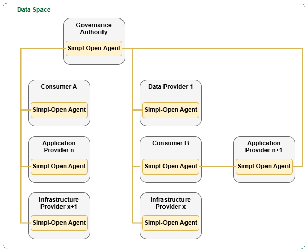

- [ESDATIB – Espai de Dades Turístiques de les Illes Balears](#esdatib--espai-de-dades-turistiques-de-les-illes-balears)
- [Objectius principals](#objectius-principals)
- [Arquitectura i marc tecnològic](#arquitectura-i-marc-tecnològic)
  - [Agents](#agents)
- [Recursos i infraestructura](#recursos-i-infraestructura)
  - [Altres requisits necessaris per al desplegament dels mòduls al clúster](#altres-requisits-necessaris-per-al-desplegament-dels-mòduls-al-clúster)
  - [Requisits del clúster](#requisits-del-clúster)
    - [Requisits Experimental](#requisits-experimental)
    - [Requisits Producció](#requisits-producció)
- [Procés d’adhesió a l’ESDATIB](#procés-dadhesió-a-lesdatib)

---

  
  &nbsp;&nbsp;&nbsp;
  

  
  &nbsp;&nbsp;&nbsp;
  

# ESDATIB – Espai de Dades Turístiques de les Illes Balears

Web oficial: https://ibtourismdataspace.org/

L’**ESDATIB (Espai de Dades Turístiques de les Illes Balears)** és una iniciativa orientada a centralitzar, visualitzar i facilitar l’accés a dades turístiques rellevants de les Illes Balears. Està pensada per donar servei a la comunitat, al teixit empresarial i a les administracions públiques, promovent un ús eficient, segur i interoperable de les dades.

Aquest repositori inclou els components i la documentació necessaris perquè les entitats puguin integrar-se i adherir-se a l’ESDATIB.

---

## Marc del Projecte

En el context del creixement exponencial de les dades i de l’estratègia europea per impulsar una economia basada en les dades, les Illes Balears representen un cas especialment rellevant a causa del pes estratègic del sector turístic. La gestió eficient, segura i sostenible de les dades turístiques és clau per millorar la competitivitat del sector, garantir la sostenibilitat del territori i oferir serveis públics i privats de més qualitat.

En aquest marc, s’està treballant en el desplegament de Simpl-Open com a infraestructura base per a la creació d’un espai de dades turístic a les Illes Balears, alineat amb les polítiques de la Unió Europea. Simpl-Open, com a middleware de codi obert, modular i interoperable, permet federar dades, aplicacions i infraestructures provinents de diferents actors del sector turístic —administracions públiques, empreses, centres de recerca i proveïdors tecnològics— garantint la sobirania de les dades, la seguretat i la interoperabilitat.

L’ús de Simpl-Open facilita un model descentralitzat de compartició i processament de dades, permetent que la informació es tracti més a prop de la seva font (al edge), fet especialment rellevant en un territori insular amb una elevada pressió estacional. Aquest enfocament contribueix a millorar l’eficiència energètica, reduir costos i augmentar la resiliència dels serveis digitals.

La creació d’un espai de dades turístic basat en Simpl-Open permetrà integrar i reutilitzar dades procedents de diferents fonts, com ara fluxos de visitants, mobilitat, ocupació hotelera, recursos naturals, serveis públics i impacte ambiental. Això possibilitarà una presa de decisions més informada, tant per part del sector públic com del privat, afavorint polítiques turístiques més sostenibles, una millor planificació territorial i una experiència turística de major qualitat.

A més, aquest desplegament posiciona les Illes Balears com un territori pilot i referent dins la Federació Europea del Núvol i els espais de dades sectorials, contribuint a l’objectiu europeu de crear una societat impulsada per les dades, alhora que es preserven els interessos locals, la transparència i la governança compartida.

---

## Objectius principals

- Facilitar l’accés, la reutilització i la compartició de dades.
- Millorar la presa de decisions basada en dades.
- Impulsar la interoperabilitat i els espais de dades sectorials.
- Fomentar la innovació i la col·laboració públic-privada.

---

## Arquitectura i marc tecnològic

L’arquitectura base de l’ESDATIB es desenvolupa sobre **SIMPL OPEN**, una iniciativa europea que forma part del programa **SIMPL**.

🔗 Més informació sobre SIMPL:  
https://simpl-programme.ec.europa.eu/

SIMPL OPEN proporciona una infraestructura que assegura:
- Interoperabilitat entre sistemes i actors.
- Governança de dades.
- Sobirania i control dels participants.
- Compliment dels principis europeus d’espais de dades.

Al nucli dels espais de dades hi ha els cinc tipus d’actors que Simpl-Open considera. Aquests actors són una representació simbòlica d’una xarxa distribuïda de parts cooperants dins d’un ecosistema obert. Simpl-Open, representat pel Agent Simpl-Open, s’estén a través d’aquests actors i permet la compartició d’actius entre ells. Proporciona serveis comuns sobre els quals es poden construir els espais de dades.

Simpl-Open es manté agnòstic respecte a les particularitats d’un espai de dades concret, fet que permet afegir serveis específics de cada espai de dades per damunt de Simpl-Open. Aquesta capa addicional pot, per exemple, contenir estàndards de representació de dades, fer complir certificacions comunes de qualitat o definir normes de revisió entre iguals (peer review) per avaluar la qualitat de les dades. Els serveis específics de l’espai de dades adapten l’ecosistema més enllà de la simple compartició d’actius, assegurant que aquests actius esdevinguin valuosos per als participants.

Simpl-Open no només té com a objectiu ser utilitzat per construir espais de dades, sinó que també crea interoperabilitat entre diferents espais de dades. A mesura que múltiples espais de dades incorporen Simpl-Open, aquests esdevenen més connectats. Això permet que els serveis travessin els límits dels espais de dades específics. Inicialment, aquests serveis seran més limitats, ja que Simpl-Open no pot capturar els detalls de tots els espais de dades diferents. Correspondrà a l’usuari gestionar les especificitats de cada espai de dades a l’hora d’interpretar els actius que obté.

Per fer aquesta visió il·lustrativa més tangible, la figura següent presenta un exemple de com un conjunt d’actors distribuïts es podria interconnectar per formar un espai de dades. És important remarcar que aquesta figura mostra només un possible escenari entre moltes formes diferents d’interacció entre participants. El nombre de participants en un espai de dades, o el nombre de parts interessades darrere d’un sol actor, només està limitat per la viabilitat tècnica. Això implica que un gran nombre de participants i parts interessades poden interactuar simultàniament. L’Agent Simpl-Open que apareix a la figura serveix com a component abstracte que els actors han de desplegar per formar part de l’espai de dades.

### Agents

SIMPL OPEN es fonamenta en una estructura d’agents, on cadascun pot desenvolupar funcions específiques dins de l’espai de dades. Actualment, s’identifiquen tres tipus d’agents principals:

- **CONSUMER**: són els actors que cerquen, accedeixen i utilitzen les dades posades a disposició pels proveïdors de dades. L’ús de les dades es realitza sempre d’acord amb les polítiques i condicions establertes pels proveïdors i amb el marc de governança definit per l’espai de dades.
- **PROVIDER**: són els actors que ofereixen un o més conjunts de dades dins l’espai de dades. Aquests agents mantenen el control sobre les seves dades i en regulen l’ús mitjançant polítiques d’accés, condicions d’ús i requisits específics, assegurant que les dades es comparteixin de manera segura.
- **AUTHORITY**: és el responsable de definir, crear, desenvolupar, operar i mantenir el framework de governança de l’espai de dades. Aquest agent vetlla pel compliment de les normes, polítiques i mecanismes comuns que regulen la compartició, l’accés, la seguretat i l’ús de les dades, garantint la confiança entre tots els participants. A més, s’encarrega de registrar els participants dins de l’espai de dades i de gestionar tant els certificats acreditatius com les credencials associades.

En aquest cas, l’**agent de governança (AUTHORITY)** és desplegat per l’administració de l’ESDATIB.  
Qualsevol altra entitat que vulgui adherir-se necessitarà desplegar els agents corresponents a les accions que desitgi realitzar, sent necessari disposar dels agents **CONSUMER** i **PROVIDER** per poder accedir i pujar dades dins de l’espai.

A part dels agents principals, que permeten realitzar accions actives dins de l’espai, cada entitat necessita abans desplegar un **paquet comú**, anomenat **COMMON**.  
Aquest paquet és necessari **una sola vegada per entitat**, i no per cada agent, i conté les configuracions i recursos bàsics que permeten que els agents funcionin correctament dins de l’ESDATIB.

---

## Recursos i infraestructura

L’arquitectura **SIMPL OPEN** ha estat desenvolupada amb la intenció de ser desplegada en un **clúster de Kubernetes**.  
Per aquest motiu, qualsevol entitat que vulgui adherir-se a l’ESDATIB i accedir a l’espai de dades haurà de disposar d’un **clúster de Kubernetes** operatiu on fer el desplegament.  

El **component COMMON** i els agents necessaris per a l’entitat (**CONSUMER**, **PROVIDER** o ambdós) hauran de ser desplegats en aquest clúster, amb els arxius de configuració ja preparats per utilitzar l’eina **ArgoCD**.  

Tot i això, el primer pas de sol·licitud d’adhesió a l’espai de dades **no requereix tenir habilitat el clúster ni haver desplegat cap agent**.  

Es recomana utilitzar un **servei cloud**, ja que facilita el desplegament i el manteniment. L’equip de l’ESDATIB ha utilitzat el servei de **Azure**, que és on es pot oferir més suport.

### Requisits del clúster

#### Requisits Experimental

Actualment, l’espai es troba en una fase primigènia i els requisits es mantenen segons l’estàndard experimental fixat pels desenvolupadors de SIMPL.

| Components desplegats       | Worker Nodes | Persistent Volumes (RWO) | CPU per node | RAM per node |
|-----------------------------|-------------|--------------------------|-------------|--------------|
| Common + Consumer           | 3           | 11 GB                    | 4           | 16 GB        |
| Common + Provider           | 3           | 11 GB                    | 4           | 16 GB        |
| Common + Provider + Consumer| 4           | 11 GB                    | 4           | 16 GB        |

#### Requisits Producció

> ⚠️ PROXIMAMENT

### Altres requisits necessaris per al desplegament dels mòduls al clúster

- **DNS / Hostname**  
  Cada entitat necessita un **domini** que s’utilitzarà com a base per crear les adreces dels diferents serveis dels agents dins de l’espai de dades.
---

## Procés d’adhesió a l’ESDATIB

El procés d’adhesió o **onboarding** compta amb **dues parts diferenciades**:

### 1. Part sense necessitat de desplegament ni configuració
- Sol·licitud d’integració a l’ESDATIB:  
  L’entitat genera una sol·licitud que serà gestionada per l’administració de governança de l’ESDATIB.  

### 2. Part amb desplegament dels agents
- En aquesta fase ja és necessari **desplegar els agents al clúster** per poder accedir als seus serveis i obtenir les credencials corresponents.

Consulta la **[Guia de procés d’adhesió](OnBoarding/README.md)**.

---

## Desplegament dels Agents

Com s’ha mencionat prèviament, **SIMPL OPEN**, base de l’ESDATIB, està construït amb paquets d’agents que permeten desenvolupar les seves diferents funcions dins l’espai de dades.  

Actualment existeixen els agents **Consumer** i **Provider**, a més de la **Governança**, gestionada per l’administració de l’ESDATIB.

Com els seus noms indiquen, cada agent permet realitzar accions de consum o subministrament de dades, respectivament.  
Tots els agents han de ser desplegats en un **clúster de Kubernetes prèviament configurat**.

Consulta la **[Guia de procés de desplegament](Desplegament/Readme.md)**.

---

## Usuaris i Rols 

Els agents disposen de diferents serveis propis, creats com a subdominis del **hostname** de l’entitat, portals on es poden desenvolupar accions específiques.

Per accedir-hi es necessiten credencials, que venen configurades de manera predeterminada amb **rols diferenciats**.

Consulta la **[Guia d’Usuaris i Rols](Usuaris_i_Rols/README.md)**.

---

## Procés d’oferta de dades a l'ESDATIB (Provider)

Un cop completat el desplegament i realitzat l’OnBoarding d’un agent **Provider**, l’entitat pot **publicar dades** a l’espai.

Consulta la **[Publicació de dades al catàleg](Publicació_Dades/README.md)**.

---

## Accés i consum de dades a l'ESDATIB (Consumer)

Un cop completat el desplegament i realitzat l’OnBoarding d’un agent **Consumer**, l’entitat pot accedir al **catàleg** i començar a consumir les dades publicades.

Consulta la **[Accés a dades al catàleg](Procés_consum_dades/README.md)**.

