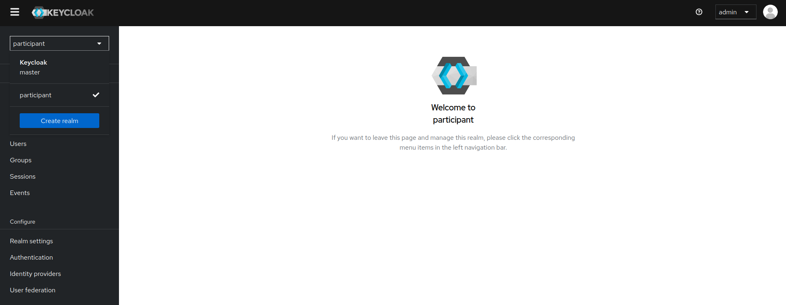
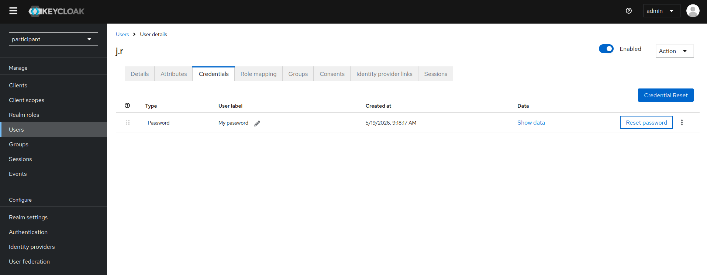

# Rols definits i Usuaris associats

- **SD_CONSUMER**: usuari consumidor  
- **SD_PUBLISHER**: usuari publicant  
- **CATALOG_R**: gestor del catàleg  
- **ONBOARDER_M**: encarregat de desplegar el Tier 2 de l’agent  
- **T1UAR_M**: gestor de rols i usuaris en el Tier 1

### Usuaris predefinits i rols associats

| Usuari | Rol |
|--------|-----|
| a.w | ONBOARDER_M, T1UAR_M |
| t.w | T1UAR_M |
| m.b | CATALOG_R, SD_CONSUMER |
| j.r | CATALOG_R, SD_PUBLISHER |
| s.p | SERVICE_PROVIDER |

---

## Credencials dels Usuaris

Per gestionar les credencials dels usuaris que utilitza cada agent, s’utilitza el servei de Tier-1 anomenat **Keycloak**. Aquest es trobarà a la URL:

`https://participant.be.<agent>.<hostname>/auth`

Keycloak demana un **usuari** i una **contrasenya d'entrada**, que es poden obtenir al servei **OpenBao**, el Vault de secrets dels nostres agents.

---

# Serveis de l'Agent Proveïdor

Els serveis de l'agent **Provider** es poden classificar de la manera següent:

- **Creació de Descripcions**: Serveis relacionats amb la creació i publicació de descripcions de conjunts de dades al **catàleg federat de dades**.  
- **Consulta de Descripcions**: Serveis relacionats amb la consulta al catàleg federat de dades.  
- **Atributs d'identitat**: Serveis que gestionen els atributs d'identitat dins l'agent.  
- **Rols d'usuari**: Serveis que gestionen els rols dels usuaris dins l'agent.

### Detall de Funcionalitats

| Funcionalitat | URL | Rol requerit |
|---------------|-----|--------------|
| Creació de keypairs, CSR i pujada de certificats x.509 | `https://participant.fe.<agent>.<hostname>/participant-utility/agent-configuration` | ONBOARDER_M, T1UAR_M |
| Veure els atributs d'identitat | `https://participant.fe.<agent>.<hostname>/users-roles/identity-attributes-info` | T1UAR_M |
| Assignar atributs d'identitat a rols | `https://participant.fe.<agent>.<hostname>/users-roles/roles` | T1UAR_M |
| Creació de descripcions amb SD Tooling | `https://sd-ui.<agent>.<hostname>/` | CATALOG_R, SD_PUBLISHER |
| Consulta al catàleg federat de dades | `https://catalogue-ui.<agent>.<hostname>/` | CATALOG_R, SD_PUBLISHER |

---

# Serveis de l'Agent Consumidor

Els serveis de l'agent **Consumer** es poden classificar de la següent manera:

- **Consulta de Descripcions**: Serveis relacionats amb la consulta al catàleg federat de dades.  
- **Atributs d'identitat**: Serveis que gestionen els atributs d'identitat dins l'agent.  
- **Rols d'usuari**: Serveis que gestionen els rols dels usuaris dins l'agent.

### Detall de Funcionalitats

| Funcionalitat | URL | Rol requerit |
|---------------|-----|--------------|
| Creació de keypairs, CSR i pujada de certificats x.509 | `https://participant.fe.<agent>.<hostname>/participant-utility/agent-configuration` | ONBOARDER_M, T1UAR_M |
| Veure els atributs d'identitat | `https://participant.fe.<agent>.<hostname>/users-roles/identity-attributes-info` | T1UAR_M |
| Assignar atributs d'identitat a rols | `https://participant.fe.<agent>.<hostname>/users-roles/roles` | T1UAR_M |
| Consulta al catàleg federat de dades | `https://catalogue-ui.<agent>.<hostname>/` | CATALOG_R, SD_CONSUMER |

---

# Com canviar les contrasenyes dels usuaris de l'agent

**1. Trobar el pod de keycloak de l'agent.**

1.1 Entrar a argocd

1.2 Entrar dins l'agent

1.3 Cercar el pod

**2. Trobar la url de keycloak**

2.1 Pitjar damunt el pod i anar a "summary" (sengos la vista seleccionada només caldrà pitjar damunt el pod)

2.2 Trobareu un yaml i copiareu la primera url que hi ha després de la variable "KC_HOSTNAME_ADMIN".

**3. Trobar les credencials d'accés**

3.1 Entrar a openbao

3.2 Common01 --> <nom-del-namespace-de-l'agent>-keycloak

3.3 El nom de l'usuari és el que apareix a la columna "key" i la contrasenya a la columna "value"

**4. Canviar la contrasenya de l'usuari**

4.1 Canviar el realm "keycloak" per "participant" tal com es mostra a la següent imatge:

4.2 Anar a la secció "users" --> seleccionar un usuari --> anar a "credentials" --> "reset password" tal com es mostra a la següent imatge:

